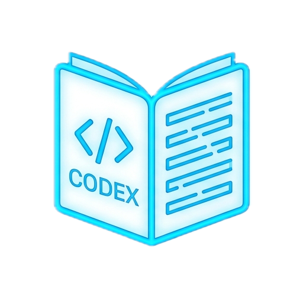

<p align="center">
  
</p>

<h1 align="center">Codex Limit Bar</h1>

<p align="center">
  Нативный индикатор лимитов Codex для строки меню macOS.
</p>

<p align="center">
  <a href="README.md">English</a> · <a href="README.uk.md">Українська</a> · <strong>Русский</strong>
</p>

<p align="center">
  
  
  <a href="https://github.com/Vitashka2001/codex-limit-bar/actions/workflows/ci.yml"></a>
  <a href="https://github.com/Vitashka2001/codex-limit-bar/releases/latest"></a>
</p>

Codex Limit Bar показывает остаток доступного лимита прямо в строке меню. Приложение автоматически выбирает самое короткое доступное окно, а в раскрывающемся меню показывает подробности по 5-часовому и недельному лимитам.

## Возможности

- процент и цветная шкала в строке меню;
- зелёный цвет при 50–100%, жёлтый при 20–49% и красный ниже 20%;
- подробные 5-часовой и недельный лимиты со временем сброса;
- отображение активного аккаунта и тарифного плана;
- переключение аккаунта Codex через официальный вход в браузере;
- английский, украинский и русский языки интерфейса;
- ручное обновление, приостановка мониторинга и запуск при входе;
- нативная светлая и тёмная тема.

## Требования

- macOS 13 Ventura или новее;
- установленный [Codex](https://openai.com/codex/) или официальное расширение Codex для VS Code/Cursor;
- выполненный вход в Codex.

Codex Limit Bar использует локальный `codex app-server`. Отдельный API-ключ приложению не нужен.

## Установка

1. Скачайте `Codex-Limit-Bar-1.1.1.dmg` на странице [последнего релиза](https://github.com/Vitashka2001/codex-limit-bar/releases/latest).
2. Откройте образ и перетащите **Codex Limit Bar** в `Applications`.
3. Запустите приложение. Его индикатор появится в правой части строки меню.

Публичная сборка подписана локальной подписью, но не нотарифицирована Apple. Если macOS заблокирует первый запуск, нажмите приложение правой кнопкой, выберите **Открыть** и подтвердите запуск. Это требуется только один раз.

## Язык

Откройте меню, выберите **Язык**, затем **English**, **Українська** или **Русский**. Приложение автоматически перезапустится и запомнит выбор. До ручного выбора используется предпочтительный язык macOS.

## Управление

- **Мониторинг лимитов** временно останавливает фоновое обновление.
- **Сменить аккаунт Codex...** открывает официальный вход и меняет активный аккаунт Codex на этом Mac.
- **Запускать при входе** включает или отключает автозапуск.
- **Полностью выключить** завершает приложение.

Чтобы полностью отключить утилиту, сначала снимите галочку **Запускать при входе**, затем выберите **Полностью выключить**. Для повторного включения откройте приложение из `Applications`.

## Приватность

Приложение не читает и не сохраняет пароли, токены или API-ключи. Оно запускает установленный локально Codex и получает только сведения об аккаунте и лимитах. Подробнее: [PRIVACY.ru.md](PRIVACY.ru.md).

## Сборка из исходников

Понадобятся Xcode Command Line Tools и Swift 6:

```sh
swift test
./scripts/build-app.sh
```

Готовое приложение появится в `dist/Codex Limit Bar.app`.

Для создания Universal DMG и ZIP для Apple Silicon и Intel:

```sh
./scripts/package-release.sh
```

## Статус проекта

Это независимая open-source утилита, а не официальный продукт OpenAI. Локальный протокол Codex может меняться между версиями, поэтому сообщения о несовместимости и pull request приветствуются.

Проект распространяется по лицензии [MIT](LICENSE).
